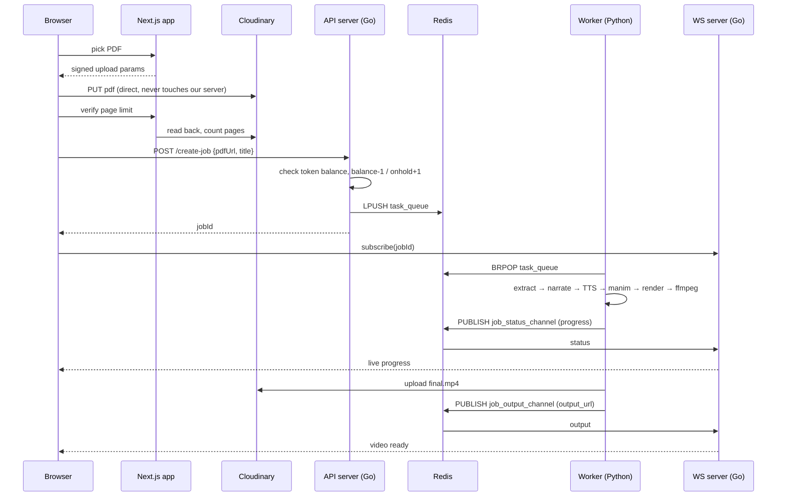
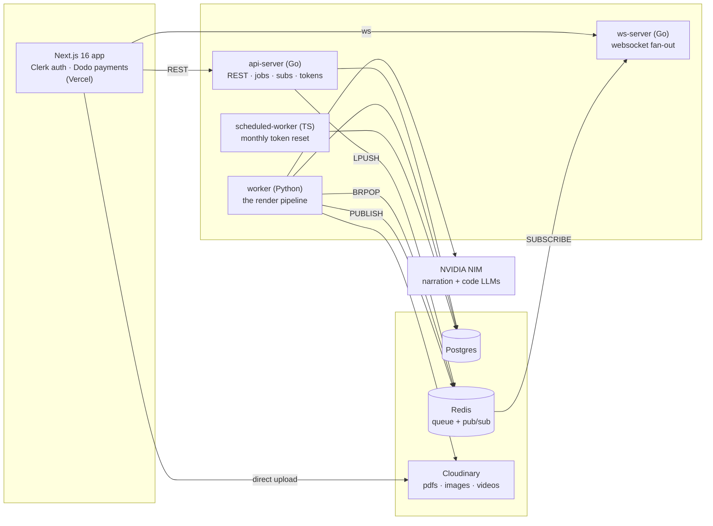

# Probso

**Turn any PDF into a narrated, animated video lecture.**

Upload a PDF - a chapter from a book, your class notes, a slide deck - and Probso gives
you back an MP4 where every page has been turned into a Manim animation with a teacher's
voice-over explaining it.

Live at **[probso.live](https://probso.live)**

---

## The story behind it

I kept running into the same wall: a PDF full of dense, badly explained material - part of a
textbook, someone's notes, a lecture deck, and no way to actually *get* it. Every time I'd
think: *if only there were a tutorial video for this exact PDF.*

In higher studies, that video usually doesn't exist. The topics are narrow enough that
nobody has made a good YouTube lecture on them, and when something does exist, it's often
not good.

But we know audio-visual explanation is easier for the human brain to follow and to
remember than a wall of static text. So the fix was obvious: don't go looking for a video
of the topic - *make the video out of the PDF itself.*

That's Probso.

---

## Demo

https://github.com/user-attachments/assets/931b4076-37b2-4de7-87c4-6c0eb581c944

---

## How it works

A PDF page is not one thing - it's text, and diagrams, and an implied explanation somebody
would give if they were standing at a whiteboard. Probso pulls those apart and rebuilds
them as video, one page at a time.

For **each page**:

1. **Extract**: the text layer is read with PyMuPDF, with a Tesseract OCR pass as fallback
   for image-based pages. Embedded diagrams are extracted as PNGs.
2. **Narrate**: the page text *and* its diagrams go to a multimodal LLM with a
   "you are a teacher explaining this aloud" prompt. It doesn't read the page out; it
   explains it. The narration is spoken by [Piper](https://github.com/rhasspy/piper) TTS,
   locally, producing `page_N_narration.mp3`.
3. **Time it**: the narration is split into sentences and each sentence gets a duration
   estimated from its share of the audio length. Those durations become the animation's
   `wait()` values, so the visuals stay in step with the voice.
4. **Animate**: a code-generation LLM writes a standalone [Manim](https://www.manim.community/)
   scene for the page, using the page's own diagrams as `ImageMobject`s and the sentence
   timings as placeholders. The output is sanitized (bad `VGroup`/`ImageMobject` mixes,
   invalid transforms, non-ASCII characters, unreplaced timing placeholders).
5. **Render and self-repair**: each scene renders in its own `manim` subprocess, in
   parallel. If a render fails, the actual Manim traceback plus the failing script are sent
   back to the LLM, which returns a unified diff. The diff is applied, syntax-checked, and
   the scene is retried (3 attempts by default). Every attempt is logged to
   `render_errors.json` and every diff is saved.

Then, for the **whole job**: audio is muxed onto each page's clip with ffmpeg, the clips are
concatenated in page order, a watermark is overlaid, and the final MP4 is uploaded to
Cloudinary.

**A failed page doesn't kill the job.** Scenes are isolated — if one page can't be rendered
after its retries, the rest still ship. The job only fails if *every* page fails.

---

## The flow



**Tokens.** One conversion costs one token. It moves `balance → onhold` when the job is
enqueued, is consumed on success, and is refunded back to `balance` if the job fails.
Balances reset monthly via a cron job in `scheduled-worker`.

---

## Architecture



Four services, one queue. The split exists because the three jobs have completely
different shapes: the API is request/response and needs to be fast, the render is a
multi-minute CPU-bound batch, and the progress feed is a long-lived connection. Redis is
both the handoff (`task_queue`, a list) and the back-channel (`job_status_channel` /
`job_output_channel`, pub/sub), so the worker never has to know who's listening.

| Service | Stack | Port | Job |
|---|---|---|---|
| `app` | Next.js 16, React 19, Tailwind v4, Clerk, Dodo Payments | 3000 | UI, auth, checkout, signed direct-to-Cloudinary upload, page-limit enforcement |
| `api-server` | Go, gorilla/mux, GORM | 8080 | Jobs, conversions, subscriptions, roles, token balances, support messages. Clerk JWKS middleware |
| `ws-server` | Go, gorilla/websocket | 9090 | Subscribes to Redis channels, fans out per-`jobId` to browsers. Ping/pong heartbeat |
| `worker` | Python 3.11, Manim 0.19, PyMuPDF, Tesseract, Piper, ffmpeg | — | The whole pipeline above. Long-polls the queue forever |
| `scheduled-worker` | TypeScript, Prisma | — | Cron entry point: `node dist/index.js monthlyTokenReset` |

**Models** (via NVIDIA NIM, OpenAI-compatible API):
- Narration (multimodal, reads diagrams): `nvidia/nemotron-3-nano-omni-30b-a3b-reasoning`
- Manim code generation + repair diffs: `nvidia/nemotron-3-ultra-550b-a55b`

Both calls go through a retry wrapper with exponential backoff, jitter, and `Retry-After`
support, because a 429 mid-job would otherwise cost you the whole render.

---

## Repo layout

```
app/                  Next.js frontend
api-server/           Go REST API
  handlers/ router/ db/ middleware/ jobqueue/ jsonschemas/ subscription/
ws-server/            Go websocket server
worker/               Python render pipeline
  worker.py           queue loop: claim job, run pipeline, upload, publish, refund on failure
  render_pipeline.py  extract → generate → render (parallel, with repair) → mux → concat → watermark
  llm.py              narration, TTS, Manim generation, repair-diff requests
  prompt.py           the three system prompts
  pdf_tools.py        PyMuPDF text/image extraction + OCR fallback
  codeformattor.py    static fixes for LLM-generated Manim
  utils.py            status publishing, unified-diff application, Cloudinary upload
  process_job.py      CLI entry: python process_job.py <job_id> [--rerender]
scheduled-worker/     cron jobs
demo/                 demo video
```

---

## Running it locally

```bash
git clone https://github.com/swaparup36/probso.git
cd probso

# fill these in — see each service's .env.example
cp worker/.env.example worker/.env
cp api-server/.env.example api-server/.env
cp ws-server/.env.example ws-server/.env
cp app/.env.example app/.env

set -a
source ./app/.env
set +a
docker compose up --build
```

Brings up Postgres, Redis, migrations, the API (`:8080`), the websocket server (`:9090`),
the worker, and the app (`:3000`).

You'll need: an **NVIDIA NIM** API key, a **Cloudinary** account, **Clerk** keys, and
**Dodo Payments** keys if you want checkout to work.

### Running the pipeline on its own

The worker doubles as a CLI, which is how you iterate on prompts without going through the
whole stack:

```bash
cd worker
mkdir -p tmp/testjob && cp /path/to/input.pdf tmp/testjob/input.pdf
python process_job.py testjob

# re-run only the Manim render + repair loop against already-generated scripts
python process_job.py testjob --rerender
```

Everything a job produced stays under `worker/tmp/<job_id>/` — extracted text, diagrams,
narration audio, the raw and sanitized scene scripts, applied repair diffs, per-scene
renders, and `render_errors.json`. That directory is the first place to look when a video
comes out wrong.

### Knobs

| Variable | Default | Effect |
|---|---|---|
| `MANIM_MAX_RENDER_ATTEMPTS` | `3` | Render tries per scene before giving up on that page |
| `LLM_MAX_ATTEMPTS` | `5` | Retries per LLM call |
| `LLM_MAX_CONCURRENCY` | `4` | Pages generated in parallel |
| `LLM_RETRY_BASE_DELAY` / `LLM_RETRY_MAX_DELAY` | `5` / `60` | Backoff bounds, seconds |

Render output is fixed at 720p30. Scene renders run at up to 4 in parallel, capped by CPU
count.

---

## Deployment

Pushing to `main` builds and pushes Docker images for `api-server`, `ws-server`, and
`worker` to Docker Hub (path-filtered, so only what changed rebuilds). The frontend deploys
to Vercel.
